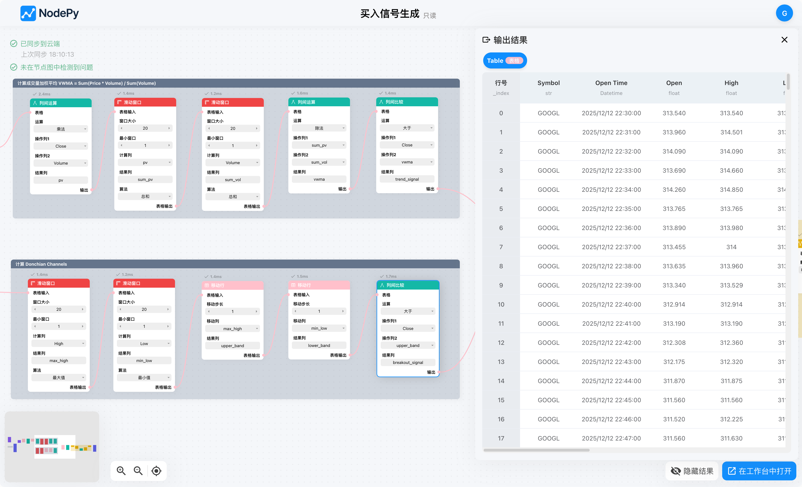
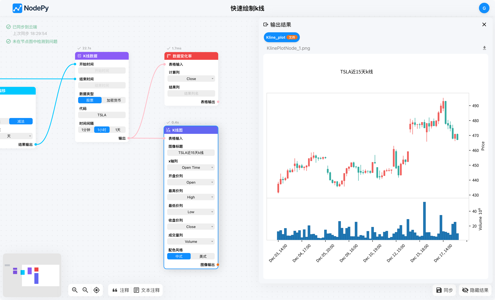
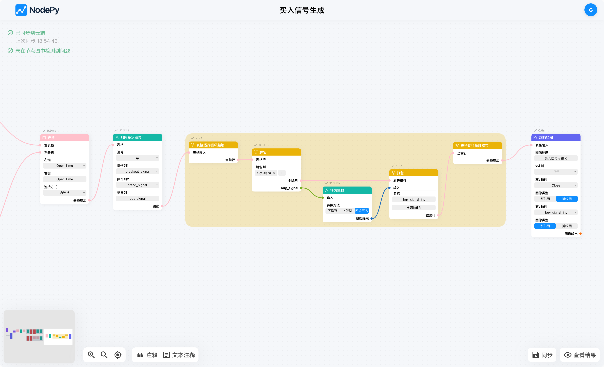
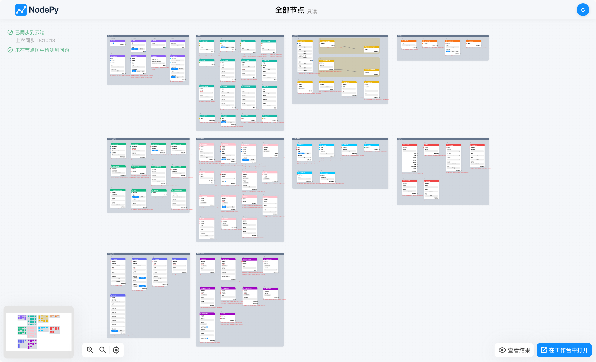
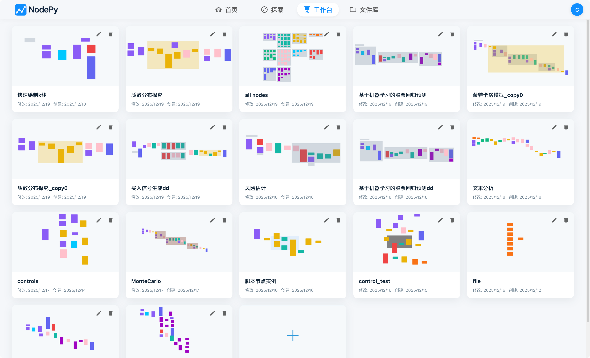
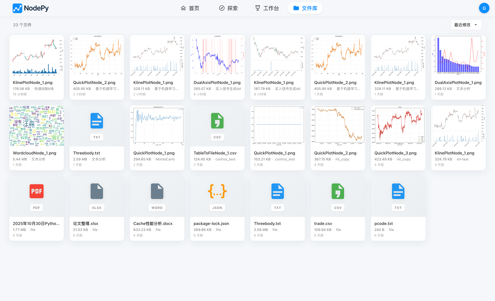
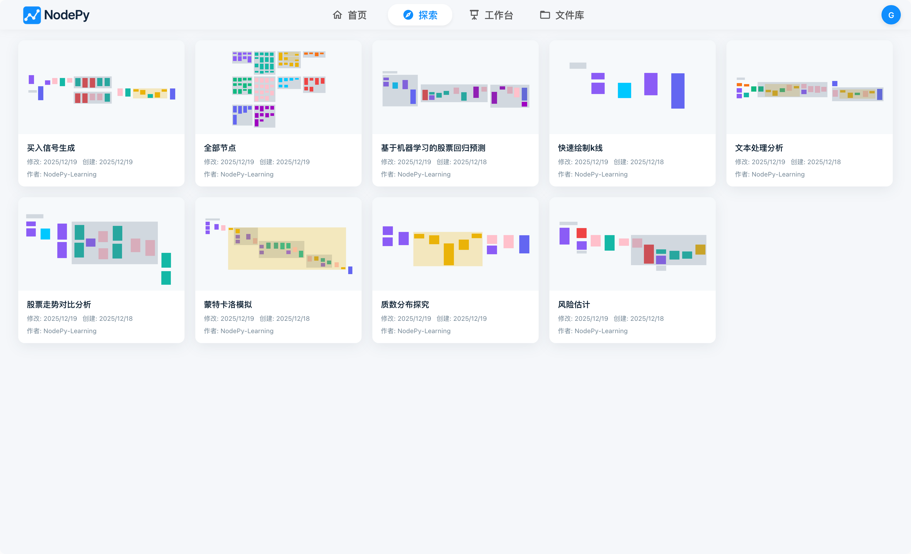
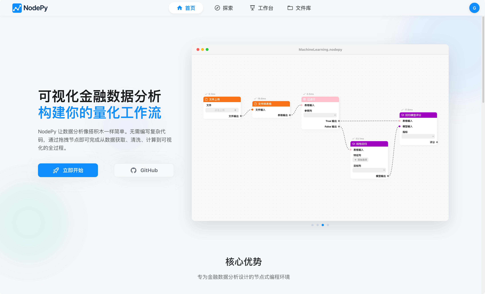

<div align="center">
    
    <!-- <h1>NodePy</h1> -->
</div>

# NodePy

NodePy 是一个基于节点的金融数据分析平台，用户可以通过可视化界面创建和执行复杂的数据处理和分析工作流。NodePy 提供了丰富的节点类型，涵盖数据导入、清洗、转换、分析和可视化等功能。

<div align="center">
    
</div>

## 功能预览

- **包含90+节点**：支持数据导入、清洗、转换、分析、机器学习和可视化等功能。
- **为金融数据分析而设计**：内置多种金融数据处理节点。
- **可视化工作流编辑器**：通过拖拽节点创建数据处理工作流。
- **在线运行，多端共享**：支持在云端运行，随时随地访问和管理数据分析项目。
- **可自托管**：支持在本地或服务器上部署，确保数据安全和隐私。

<details>
<summary>点击展开查看更多</summary>

| | |
| :---: | :---: |
| <br>**交互式数据表格** | <br>**丰富的数据可视化** |
| <br>**逻辑编排编辑器** | <br>**10大类 90+ 节点库** |
| <br>**项目管理工作台** | <br>**云端文件管理** |
| <br>**内置丰富案例库** | <br>**立刻开始** |

</details>

## 快速开始
请确保已经安装如下依赖：
- Docker & Docker Compose
- uv (Python 包管理器)
- Node.js & npm

1. 克隆仓库
    ```bash
    git clone https://github.com/LKLLLLLLLLLL/NodePy.git
    cd NodePy
    ```
2. 安装依赖
    请先确保已经安装uv, npm。
    ```bash
    # 安装 Python 依赖 (使用 uv)
    uv sync
    
    # 安装前端依赖
    cd client
    npm install
    cd ..
    ```
3. 自定义配置
    你可以通过编辑`/server/config.py`文件来修改服务器配置，例如数据库连接、缓存设置等。
4. 构建并启动生产环境
    ```bash
    uv run task prod
    ```

## 开发指南
### 启动开发环境
#### 方案一：混合开发模式
```bash
uv run task dev
npm run dev
```
访问http://localhost:5173
#### 方案二：全容器开发模式
```bash
uv run task dev
```
访问http://localhost:8000

### 常用命令
- 快速生成 API 客户端代码
    请确保server容器正在运行
    ```bash
    cd client
    npm run gen_api
    ```
- 将某个项目持久化为example
    ```bash
    docker exec -it nodepy-server uv run task persist <project_name> [example_name]
    ```
- 检查代码格式
    ```bash
    npm run type-check
    uv run task check
    ```
